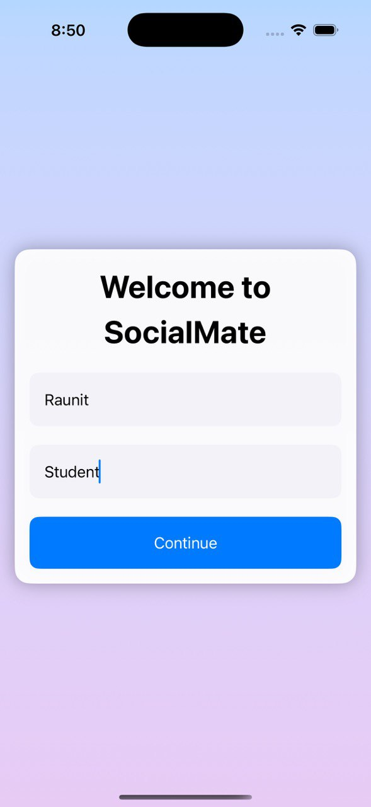
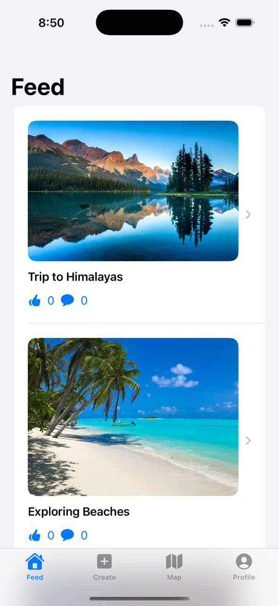
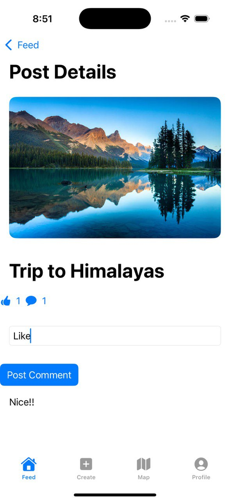
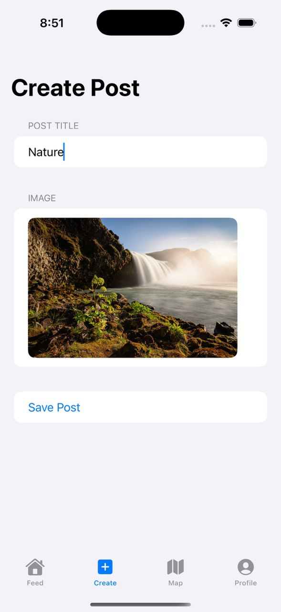
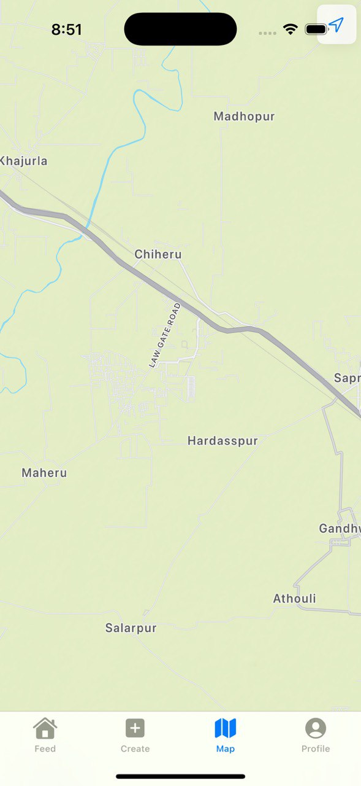
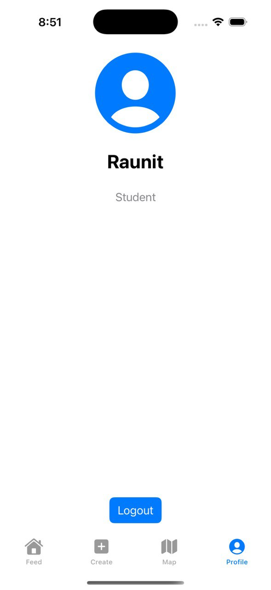

# SocialMate

SocialMate is a simple social media iOS application built with SwiftUI.  
It allows users to log in with their name and details, create posts with images, view a feed of posts, browse the web, and manage their profile.  
This project is built purely with local SwiftUI and does not require any backend service.

## Features

- **User Login**  
  Users can enter their name and details, which will be shown in their profile and persist locally.

- **Create Post**  
  Users can create new posts by adding a title and selecting an image from their photo library.

- **Feed View**  
  Posts are displayed in a feed list, with the most recent posts appearing first.

- **Post Details**  
  Tap on a post to view its full image and title in a detailed view.

- **Profile View**  
  Displays the user's name and details with an option to log out.

- **Browser View**  
  A simple embedded browser with a loading indicator (pre-configured to open Google).

## Screenshots
<div style="display: flex; align-items: center;">






</div>

## Tech Stack

- SwiftUI
- UIKit (for ImagePicker & WebView integration)
- Local storage using `@AppStorage`  
- MVVM architecture (lightweight)

## Installation

1. Clone the repository

```bash
git clone https://github.com/your-username/SocialMate.git
cd SocialMate
open SocialMate.xcodeproj
SocialMate
├── Assets.xcassets
├── SocialMateApp.swift
├── Models
│   └── Post.swift
├── Views
│   ├── LoginView.swift
│   ├── MainTabView.swift
│   ├── FeedView.swift
│   ├── CreatePostView.swift
│   ├── PostDetailView.swift
│   ├── ProfileView.swift
│   └── BrowserView.swift
├── Stores
│   └── PostStore.swift
└── Helpers
    └── ImagePicker.swift


How to Contribute
Contributions are welcome!
You can fork the repository, create a branch, make improvements, and submit a pull request.


Author
Raunit Raj
Lovely Professional University (2022–2026)
GitHub | LinkedIn

Made with ❤️ for learning and portfolio building
